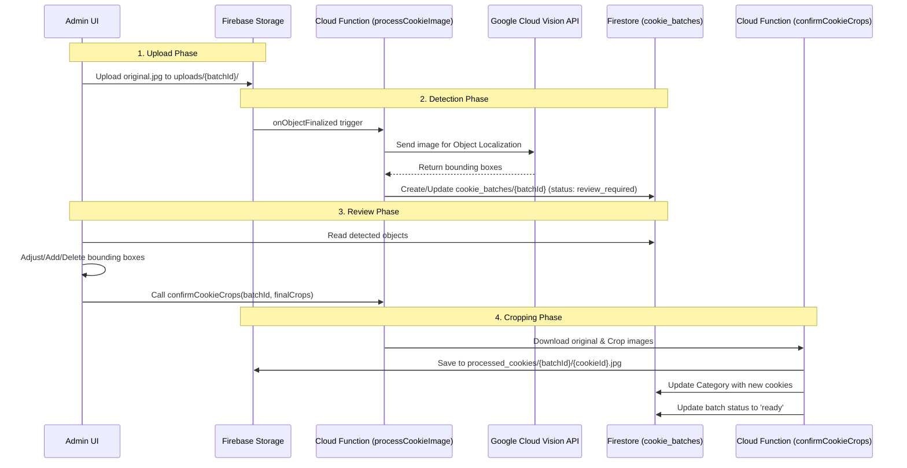

# Architecture: CookieVoting

## 1. System Overview

**CookieVoting** is a hybrid application combining a modern React 19 frontend with a serverless Firebase backend. It is designed to facilitate cookie competitions by automating the detection and categorization of cookies from tray photos.

### Core Stack
- **Frontend**: React 19, TypeScript, Vite, Tailwind CSS (v4).
- **Backend**: Firebase (Firestore, Storage, Functions, Auth).
- **AI/ML**: Google Cloud Vision API (Production) / Google Gemini (Experimental/Local).
- **Testing**: Vitest (Unit/Integration), Playwright (E2E).

---

## 2. The Cookie Detection Pipeline

The core feature of the application is the "Detect-Review-Crop" workflow, which automates the extraction of individual cookie images from a single group photo.

### detection-pipeline.mermaid

### Critical Implementation Details

1.  **Event-Driven Architecture**: The upload of an image to a specific path (`uploads/{batchId}/original.jpg`) triggers the entire pipeline.
2.  **State Management**: The state of the pipeline is tracked in the `cookie_batches` collection in Firestore.
    -   `uploading` -> `processing` -> `review_required` -> `ready` (or `error`).
3.  **Hybrid AI**:
    -   **Production**: Uses **Google Cloud Vision API** (Object Localization) via Cloud Functions. This is the stable, deployed path.
    -   **Experimental**: A local script (`scripts/detect-all-images.js`) uses **Google Gemini** for detection. This is *not* part of the production pipeline and is used for research/batch processing.

---

## 3. Frontend Architecture

The frontend is a Single Page Application (SPA) built with Vite.

-   **State Management**: Uses `zustand` for global store management (e.g., `useEventStore`, `useAuthStore`).
-   **Routing**: `react-router-dom` handles navigation between the Admin Dashboard, Voting Wizard, and Results.
-   **Styling**: `tailwindcss` v4 with a mobile-first approach.
-   **Real-time Updates**: Relies on Firestore real-time listeners (`onSnapshot`) for live voting results and batch processing status.

---

## 4. Backend Architecture

The backend logic is entirely serverless, residing in `functions/src/index.ts`.

### Security Model
-   **Authentication**: Firebase Auth (Anonymous for Voters, Email/Password for Admins).
-   **Authorization**: Custom Claims (`admin: true`) protect sensitive operations.
-   **Validation**: Firestore Security Rules (`firestore.rules`) enforce data integrity and access control at the database level.

### Key Cloud Functions
1.  `processCookieImage`: Triggered by Storage. Handles AI detection.
2.  `confirmCookieCrops`: Callable. Handles high-fidelity image cropping using `sharp`.
3.  `addAdminRole` / `removeAdminRole`: Callable. Manages RBAC.
