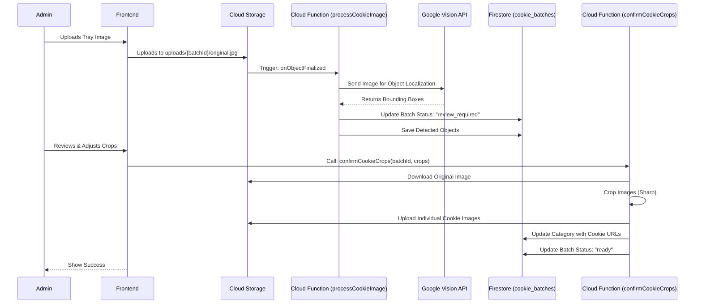

# Architecture Guide

This document provides a high-level overview of the Cookie Voting application's technical architecture.

## System Overview

The application is a modern web platform built on the **React** ecosystem, leveraging **Firebase** for backend services (Serverless Functions, NoSQL Database, Authentication, and Storage).

### Tech Stack

#### Frontend (Client)

- **Framework:** [React 19](https://react.dev/) with [TypeScript](https://www.typescriptlang.org/)
- **Build Tool:** [Vite](https://vitejs.dev/)
- **Styling:** [TailwindCSS v4](https://tailwindcss.com/)
- **UI Components:** [Radix UI](https://www.radix-ui.com/) / [shadcn/ui](https://ui.shadcn.com/)
- **State Management:** [Zustand](https://github.com/pmndrs/zustand)
- **Routing:** [React Router v7](https://reactrouter.com/)
- **Forms:** [React Hook Form](https://react-hook-form.com/) + [Zod](https://zod.dev/)

#### Backend (Serverless)

- **Platform:** [Firebase](https://firebase.google.com/)
- **Database:** Cloud Firestore (NoSQL)
- **Authentication:** Firebase Auth
- **Storage:** Cloud Storage for Firebase
- **Compute:** Cloud Functions for Firebase (2nd Gen)
- **AI/ML:** Google Cloud Vision API (Object Localization)

## Cookie Detection Pipeline

The core feature of the application is the automated detection and cropping of cookies from tray images.

### Key Components

1.  **Image Upload:** Admin uploads a high-resolution image of a cookie tray.
2.  **Detection (Async):** A Cloud Function triggers on upload, calling the Google Vision API to identify cookie boundaries.
3.  **Review Interface:** The Admin reviews the AI's suggestions on the frontend, adjusting bounding boxes as needed.
4.  **Cropping (Server-Side):** Upon confirmation, a second Cloud Function uses `sharp` to crop the high-res original image into individual assets.

## Data Flow & State Management

### Global State (Zustand)

We use Zustand for lightweight global state management, separated into domain-specific stores:

- `useAuthStore`: User session and admin status.
- `useVoteStore`: Voting logic (local selections) and real-time results (via Firestore listeners).
- `useCookieStore`: Managing cookie data for display.
- `useEventStore`: Active event context.

### Real-time Updates

The application relies heavily on Firestore real-time listeners (`onSnapshot`) for:

- Live voting results (Admin Dashboard).
- Cookie batch processing status updates.

## Testing Strategy

See `docs/TESTING_GUIDE.md` for detailed patterns.

- **Unit/Integration:** [Vitest](https://vitest.dev/) (Fast, headless)
- **E2E:** [Playwright](https://playwright.dev/) (Full browser automation)
- **Visual:** [Storybook](https://storybook.js.org/) (Component isolation)
