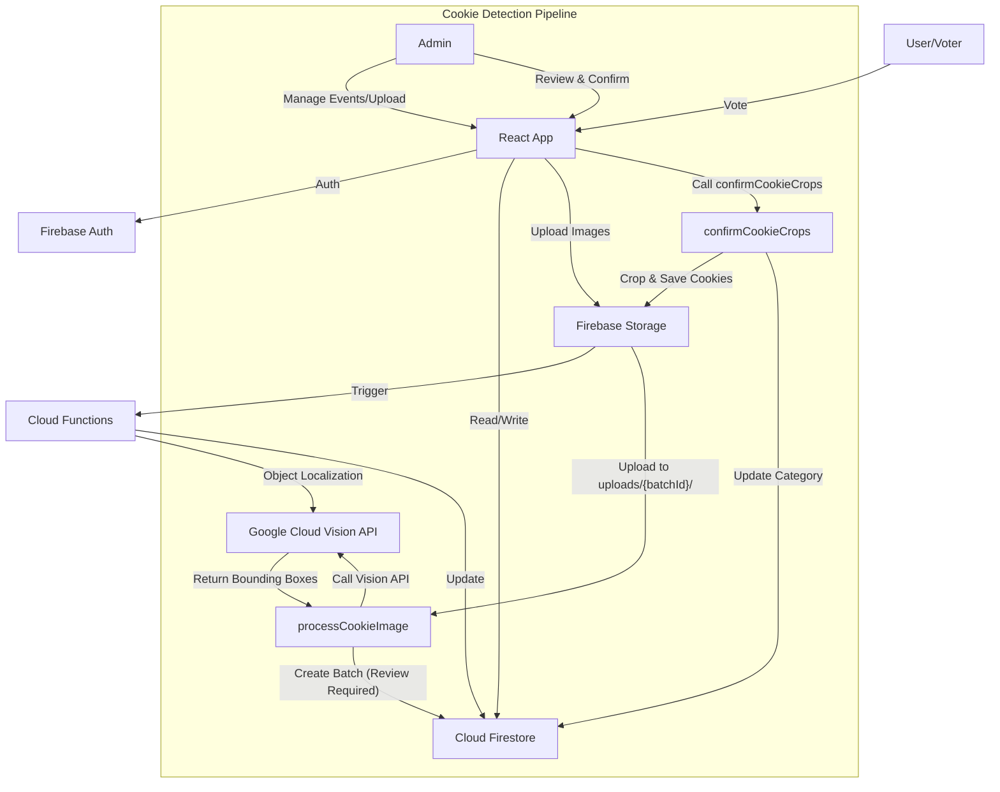

# Architecture & Design

This document outlines the technical architecture of the CookieVoting application. It serves as the primary reference for the system's design, data flow, and key components.

## High-Level Overview

CookieVoting is a serverless web application built on the **Firebase** platform. It leverages **React** for the frontend and **Cloud Functions for Firebase** for backend logic, including image processing and administrative tasks.

### Core Technologies

-   **Frontend**: React 19, TypeScript, Vite, TailwindCSS
-   **Backend**: Firebase (Auth, Firestore, Storage, Functions)
-   **AI/ML**: Google Cloud Vision API (Production), Google Gemini (Experimental/Local Scripts only)
-   **Testing**: Vitest (Unit/Integration), Playwright (E2E)

## System Architecture

## Data Model

The application uses **Cloud Firestore** as its primary database.

### Collections

#### `events`
Stores configuration and state for voting events.
-   `id`: Unique Event ID
-   `name`: Event Name
-   `status`: 'voting' | 'completed'
-   `adminCode`: Access code for admins
-   `resultsAvailableTime`: Timestamp for when results are public

#### `events/{eventId}/categories` (Sub-collection)
Represents a "plate" of cookies.
-   `id`: Category ID
-   `name`: Category Name (e.g., "Plate A")
-   `imageUrl`: URL of the full tray image
-   `cookies`: Array of `Cookie` objects (individual cropped images)

#### `cookie_batches`
Temporary storage for image processing workflows.
-   `id`: Batch ID (corresponds to an upload session)
-   `status`: 'processing' | 'review_required' | 'ready' | 'error'
-   `eventId`: Linked Event ID
-   `categoryId`: Linked Category ID
-   `originalImageRef`: Storage path of the uploaded tray image
-   `detectedObjects`: Array of bounding boxes returned by Vision API
-   `paddingPercentage`: Padding applied during cropping

#### `votes`
Stores individual user votes.
-   `userId`: Unique User ID (Anonymous or Authenticated)
-   `votes`: Map of `categoryId` -> `cookieId[]`
-   `timestamp`: Time of vote

## Cookie Detection Pipeline

The core feature of the application is the automated detection of cookies from tray images.

1.  **Upload**: Admin uploads a tray image via the Frontend. The image is stored in `uploads/{batchId}/original.jpg`.
2.  **Trigger**: `processCookieImage` Cloud Function is triggered by the storage event.
3.  **Detection**:
    -   The function downloads the image and enhances contrast using `sharp`.
    -   It sends the image to **Google Cloud Vision API** (Object Localization).
    -   Detected bounding boxes are saved to the `cookie_batches` document in Firestore with status `review_required`.
4.  **Review**:
    -   Admin views the detected boxes in the Frontend.
    -   Admin can adjust, add, or delete bounding boxes.
5.  **Confirmation**:
    -   Admin clicks "Confirm".
    -   Frontend calls the `confirmCookieCrops` Callable Function with the final crop coordinates.
6.  **Processing**:
    -   `confirmCookieCrops` uses `sharp` to crop the individual cookies from the original image.
    -   Cropped images are uploaded to `processed_cookies/` in Storage.
    -   The `categories` document is updated with the new cookie URLs.
    -   The `cookie_batches` document is marked as `ready`.

## AI Implementation Details

**Important Note on AI Providers:**
-   **Production**: The application strictly uses **Google Cloud Vision API** (`ImageAnnotatorClient`) for all production cookie detection logic deployed to Cloud Functions.
-   **Experimental**: References to "Google Gemini" in the codebase apply **only** to the local utility script `scripts/detect-all-images.js`. This script is for experimental bulk processing and is not part of the production pipeline.
