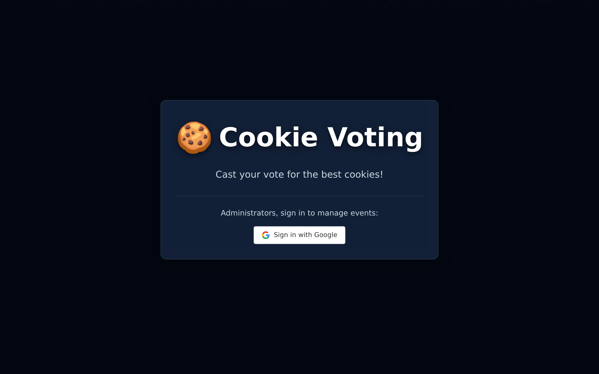

<div align="center">

# Cookie Voting 🍪

[🚀 Launch App](https://cookie-voting.web.app/) • [📖 Documentation](#documentation) • [🐞 Report Bug](https://github.com/TytaniumDev/CookieVoting/issues)

A modern web application for managing and voting on cookie competitions. Powered by AI cookie detection, Firebase, and React.



</div>

## 🚀 Quick Start

### Prerequisites
- **Node.js 20+**
- **Firebase CLI**

### Installation

**Option 1: Fast Track (Mac/Linux)**
```bash
./scripts/setup.sh
```

**Option 2: Manual Setup**
```bash
npm install
cp .env.example .env
# Update .env with your Firebase credentials
```

### Run
```bash
npm run dev
```

## ✨ Key Features

- 🤖 **AI-Powered Detection**: Automatically detects cookies using Google Cloud Vision API.
- 🗳️ **Interactive Voting**: Real-time voting system with multiple categories.
- 📊 **Live Results**: Instant tallying and leaderboard updates.
- 🛡️ **Admin Dashboard**: Comprehensive tools for event management.
- 📱 **Responsive Design**: Seamless experience across desktop and mobile.

<a id="documentation"></a>
## 📚 Documentation

### Architecture & Design
- [Product Requirements (PRD)](./docs/PRD.md)
- [Vision API Integration](./docs/VisionAPI.md)
- [Tailwind Migration](./docs/TAILWIND_V4_MIGRATION.md)

### Development & Setup
- [Emulator Setup](./docs/EMULATOR_SETUP.md)
- [Storybook Guide](./docs/STORYBOOK_SETUP.md)
- [Testing Guide](./docs/TESTING_GUIDE.md)
- [Gemini AI Setup](./docs/GEMINI_SCRIPT_SETUP.md)

### Project Standards
- [Agent Rules](./CLAUDE.md)
- [Testing Strategy](./TESTING_STRATEGY.md)

## 🛠️ Tech Stack

- **Frontend**: React 19, TypeScript, Vite, TailwindCSS
- **Backend**: Firebase (Auth, Firestore, Storage, Functions)
- **AI**: Google Cloud Vision API, Google Gemini (Experimental)
- **Testing**: Vitest, Playwright, Storybook

## 🤝 Contributing

Contributions are welcome! Please check out the [Issues](https://github.com/TytaniumDev/CookieVoting/issues) to get started.

## 📄 License

This project is private and proprietary.
