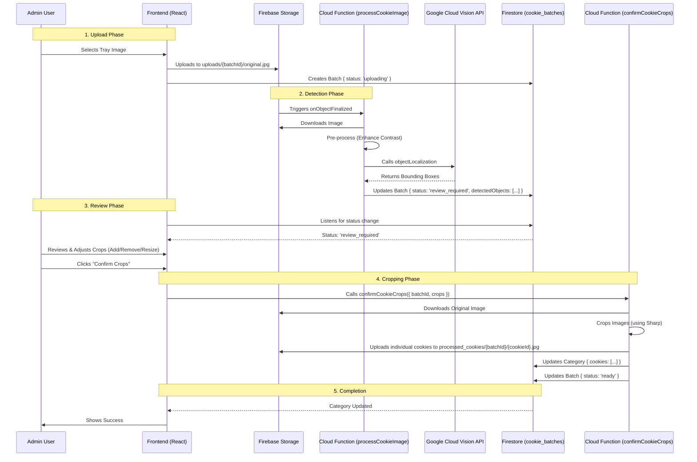

# Architecture Guide

This document provides a high-level overview of the Cookie Voting system architecture and a deep dive into its core features.

## 1. System Overview

The application follows a **Serverless Architecture** built on the Firebase platform.

-   **Frontend**: React 19 (TypeScript) + Vite + TailwindCSS.
-   **Backend**: Firebase Cloud Functions (Node.js).
-   **Database**: Cloud Firestore (NoSQL).
-   **Storage**: Firebase Storage (Images).
-   **Authentication**: Firebase Auth (Anonymous for voters, Email/Password for Admins).
-   **AI Services**: Google Cloud Vision API (Object Localization).

## 2. Core Feature: Cookie Detection Pipeline

The most complex part of the system is the automated cookie detection and cropping workflow. This process involves a "Human-in-the-Loop" step to ensure accuracy.

### Workflow Diagram

### Key Components

#### `processCookieImage` (Cloud Function)
-   **Trigger**: `storage.object().onFinalize`
-   **Responsibility**: Detects potential cookies using Cloud Vision API.
-   **Output**: Does *not* modify the Category. It only updates the `cookie_batches/{batchId}` document with `detectedObjects` and sets status to `review_required`.
-   **Logic**:
    1.  Validates file path (`uploads/{batchId}/original.jpg`).
    2.  Enhances image contrast using `sharp`.
    3.  Calls Cloud Vision API (`objectLocalization`).
    4.  Saves raw bounding boxes to Firestore.

#### `confirmCookieCrops` (Cloud Function - Callable)
-   **Trigger**: `https.onCall` (Invoked by Admin Client).
-   **Responsibility**: Performs the actual cropping and updates the production data.
-   **Input**: `batchId` and a list of validated `crops` (normalized coordinates).
-   **Logic**:
    1.  Downloads the original image.
    2.  Iterates through `crops`, extracting each cookie using `sharp`.
    3.  Uploads cropped images to `processed_cookies/`.
    4.  Updates the target `Category` document with the new `Cookie` objects (including public URLs).
    5.  Marks batch as `ready`.

## 3. Data Model

### `VoteEvent`
Represents a voting session.
-   `id`: UUID
-   `status`: 'voting' | 'completed'

### `Category` (Subcollection of Event)
Represents a plate or group of cookies.
-   `id`: UUID
-   `cookies`: Array of `Cookie` objects.
-   `batchId`: Reference to the `cookie_batches` document used for detection.

### `Cookie` (Object within Category)
-   `id`: Unique ID for the cookie (used for voting).
-   `imageUrl`: Public URL to the cropped image.
-   `bakerId`: (Optional) Reference to a Baker.

### `UserVote` (Subcollection of Event)
-   `userId`: Unique ID (Auth UID or Session ID).
-   `votes`: Map of `categoryId` -> `cookieId[]`.
