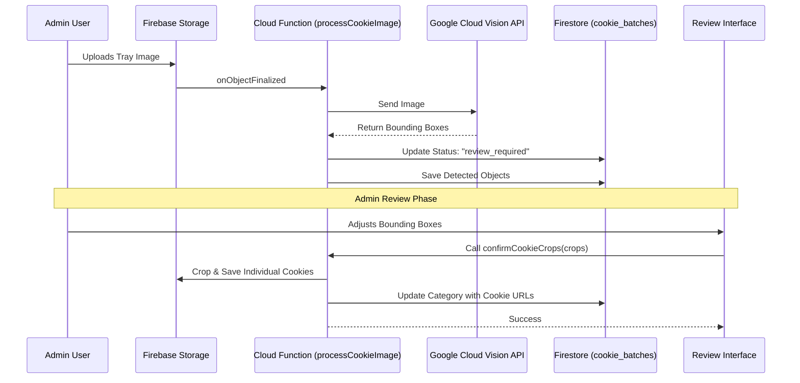

# Cookie Voting Architecture

> **Status**: Living Document
> **Last Updated**: 2024-05-23
> **Source of Truth**: `functions/src/index.ts` (Backend), `src/` (Frontend)

## 1. System Overview

Cookie Voting is a full-stack application designed to facilitate cookie competition events. The system allows administrators to upload images of cookie trays, automatically detect individual cookies using AI, and enables users to vote for their favorites.

### Core Technologies

- **Frontend**: React 19, TypeScript, Vite, TailwindCSS
- **Backend**: Firebase (Auth, Firestore, Storage, Cloud Functions)
- **AI (Production)**: Google Cloud Vision API (Object Localization)
- **AI (Experimental)**: Google Gemini API (Multimodal Analysis)

## 2. AI Detection Pipelines

The system supports two distinct AI detection pipelines. It is critical to distinguish between the **Production Pipeline** (used by the app) and the **Experimental Script** (used for bulk/local testing).

### A. Production Pipeline: Assisted Cookie Detection

This is the primary workflow used within the application. It prioritizes accuracy and human oversight ("Assisted AI").

**Key Components:**
- **Trigger**: File upload to `uploads/{batchId}/original.jpg`
- **Detector**: Google Cloud Vision API (`objectLocalization`)
- **Processor**: Google Cloud Functions (`processCookieImage`, `confirmCookieCrops`)
- **Image Manipulation**: `sharp` (for cropping)



### B. Experimental Pipeline: Gemini Script

This is a utility script located at `scripts/detect-all-images.js`. It is **not** part of the production application flow.

**Key Components:**
- **Trigger**: Manual execution of script
- **Detector**: Google Gemini API (`gemini-1.5-flash`)
- **Output**: Firestore `image_detections` collection

```mermaid
graph TD
    A[Developer] -->|Runs Script| B[scripts/detect-all-images.js]
    B -->|Reads| C[Firebase Storage (shared/cookies/)]
    B -->|Sends Image| D[Google Gemini API]
    D -->|Returns JSON| B
    B -->|Writes| E[Firestore (image_detections)]

    style B fill:#f9f,stroke:#333,stroke-width:2px
    style D fill:#bbf,stroke:#333,stroke-width:2px
```

## 3. Data Flow & State Management

### Cookie Batch Lifecycle

A "Batch" represents the processing state of a single uploaded tray image.

1. **Upload**: `status: processing`
   - Image is uploaded.
   - Cloud Function starts.
2. **Review**: `status: review_required`
   - AI has detected objects.
   - Bounding boxes are saved to Firestore.
   - User intervention is required to confirm/adjust crops.
3. **Ready**: `status: ready`
   - User has confirmed crops.
   - Individual cookie images are generated and stored.
   - `Category` document is updated with cookie references.
4. **Error**: `status: error`
   - Processing failed (e.g., Vision API error, invalid image).

### Voting Logic

Votes are stored in the `votes` collection as `UserVote` documents.

- **Collection**: `votes`
- **Document ID**: `{eventId}_{userId}` (Composite key for uniqueness)
- **Fields**:
  - `userId`: String
  - `votes`: Map<CategoryId, CookieId[]> (Supports Ranked Choice in future)

## 4. Security Model

- **Authentication**: Firebase Auth (Anonymous for voters, Email/Password for admins).
- **Authorization**: Custom Claims (`admin: true`) for administrative actions.
- **Storage Rules**:
  - `uploads/`: Write-only for admins.
  - `processed_cookies/`: Public read.
- **Firestore Rules**:
  - `votes`: Create-only for users (no updates/deletes).
  - `events`, `categories`: Read-only for users, Write for admins.
